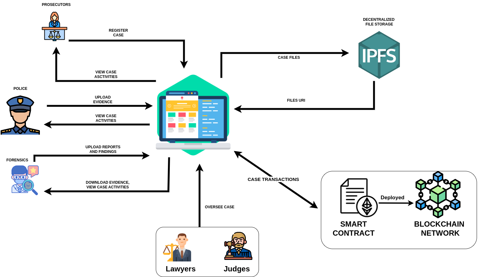

# BLEMS- BLockchain Based Legal Evidence Management System

## Project Overview

-The Blockchain-Based Legal Evidence Management System is an innovative system solution designed to revolutionize the management of digital evidence in legal proceedings. Making use of blockchain technology, this system ensures the integrity, transparency, and security of the entire evidence lifecycle.
-The system incorporates features such as decentralized ledger and smart contracts to provide a tamper-proof environment, while user authentication, role-based access control, and robust encryption mechanisms guarantee secure data handling. With a user-friendly interface, the system facilitates efficient evidence submission, retrieval, and collaboration among law enforcement agencies, forensics teams, and courts.
-This project aims to address the evolving needs of the legal landscape, offering a streamlined and trustworthy approach to evidence management in the digital age.

## Problem statement

-In the current legal landscape, the management of evidence faces significant challenges, particularly in terms of integrity, transparency, and efficiency. Traditional systems for handling digital evidence lack a standardized and secure framework, leading to potential risks such as data tampering, unauthorized access, and tiresome in retrieval processes.
-To bridge this gap, this project aims to develop a Blockchain-Based Legal Evidence Management System that combine the power of blockchain technology to ensure the immutability, transparency, and secure handling of evidence throughout its lifecycle.

## Project scope

The scope of this project aims to make handling evidence in Tanzanian legal stuff better, especially for the police and courts. The scope of the project encompasses the design and the development of an evidence management system with a focus on best evidence. It includes the creation of the user-friendly interface, secure chain of custody tracking, access control, and efficient retrieval mechanisms. The system aims to meet the needs of legal and investigative processes, promoting transparency, security, and operational efficiency in evidence management.

## Project Design
### Conceptual Diagram

###  Context diagram DFD

